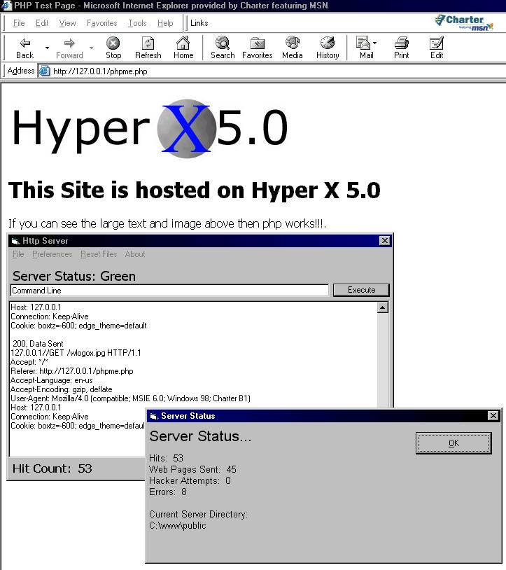



## A Complete Web Server with GET, POST, Cookie Support, and PHP\!\!\!

### Description

There are several Web Servers that have some scripting abilities but this one supports EVERYTHING!!! GET REQUEST, POST REQUEST, FORM POSTING, COOKIES, and PHP, IMAGES, MP3's, JPEGS, GIFS, and much more. The php support is so good it is Capable of running the popular web portal PHP-NUKE. If your confused and just want to see what the program can do run it, open your web browser and type in 127.0.0.1. If you want to use the server to host your own site, read the help.html in the enclosed zip file. The server can handle ANY web site, it can handle 50 simultaneous connections and more if you make a few slight changes to the Form_Load() sub. Have Fun with it and please vote for me!! I need it.
 
### More Info
 
Its a web server. You don't need a host if you have this program. To access the site that the program is hosting, open up internet explorer and type 127.0.0.1 and hit enter

It produces a log file and a settings file if thats what you mean

             |
---                |---
**Submitted On**   |2003-02-27 05:10:10
**By**             |[JokerDoom](https://github.com/Planet-Source-Code/PSCIndex/blob/master/ByAuthor/jokerdoom.md)
**Level**          |Intermediate
**User Rating**    |4.7 (163 globes from 35 users)
**Compatibility**  |VB 5\.0, VB 6\.0
**Category**       |[Complete Applications](https://github.com/Planet-Source-Code/PSCIndex/blob/master/ByCategory/complete-applications__1-27.md)
**World**          |[Visual Basic](https://github.com/Planet-Source-Code/PSCIndex/blob/master/ByWorld/visual-basic.md)
**Archive File**   |[A\_Complete155385332003\.zip](https://github.com/Planet-Source-Code/jokerdoom-a-complete-web-server-with-get-post-cookie-support-and-php__1-43598/archive/master.zip)

